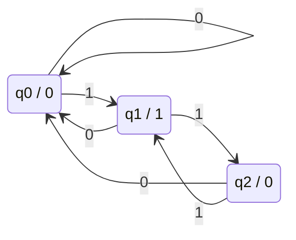

# Moore
Autómatas Finitos Deterministas con Salida
## Descripción
Este proyecto implementa un **autómata de Moore** en Python que procesa secuencias binarias, detectando y reemplazando automáticamente cada aparición del patrón **"11"** por **"00"**.

## Diagrama de Estados

El siguiente diagrama, creado con Mermaid, representa el comportamiento del autómata. Los estados se nombran como `q0`, `q1` y `q2`. La notación dentro de cada estado es `Estado/Salida`.

## Lógica del Autómata
El autómata cuenta con tres estados:
- **q0** (salida 0): Estado inicial y de espera
- **q1** (salida 1): Ha recibido un '1'
- **q2** (salida 0): Detectó el patrón "11"

### Transiciones:
q0 --0--> q0 (salida 0)
q0 --1--> q1 (salida 1)
q1 --0--> q0 (salida 0)
q1 --1--> q2 (salida 0) ← Detección de "11"
q2 --0--> q0 (salida 0)
q2 --1--> q1 (salida 1)

##  Características
- Procesamiento bit a bit de secuencias binarias
- Reemplazo automático de "11" por "00"
- Visualización paso a paso del proceso
- Muestra estados recorridos y salida final
- Interfaz interactiva por consola
- Validación de entrada (solo 0 y 1)

## Cómo usar
1. Ejecuta el programa
2. Ingresa una secuencia de bits (ej: "1101")
3. Observa el procesamiento paso a paso
4. El programa mostrará la entrada original y la salida transformada
5. Decide si quieres procesar otra secuencia

## Ejemplo de ejecución
--- Procesando: 1101 ---
Inicio: q0 (salida 0)
Bit 1='1': q0→q1 | salida: 1
Bit 2='1': q1→q2 | 11 -> 00
Bit 3='0': q2→q0 | salida: 0
Bit 4='1': q0→q1 | salida: 1
Resultado:
Entrada: 1101
Salida: 0001
Estados: q0 → q1 → q2 → q0 → q1

## Estructura del código
- `MooreAutomata.__init__()`: Inicialización del autómata
- `procesar_entrada()`: Lógica principal de procesamiento
- `main()`: Bucle interactivo con el usuario
